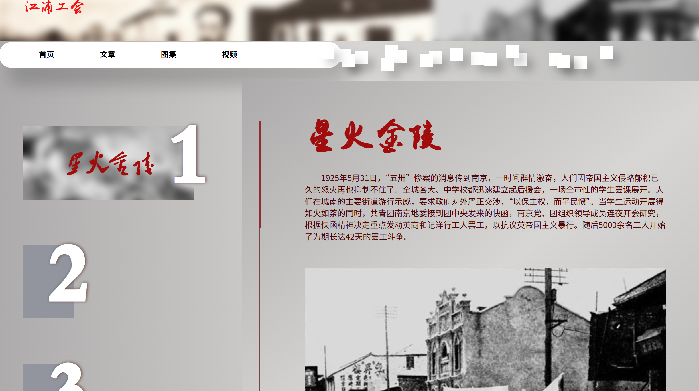

# 江浦工会 | 两浦红色工运历史宣传网站

> **本项目为本科生寒假社会实践成果展示网站**
>
> 宣传南京浦口、浦镇（“两浦”）地区波澜壮阔的工人运动历史，传承红色基因，弘扬王荷波等革命先驱的斗争精神。


## 📖 背景

南京两浦地区（浦口、浦镇）是近代中国重要的工业基地和交通枢纽，也是中国工人运动发源较早的地区之一。我们团队基于实地调研与史料整理，通过网页形式重现了从 1920 年代到 1949 年解放前夕，两浦工人在中国共产党领导下进行的英勇抗争。

网站核心内容涵盖：
*   **星火金陵**：1925年五卅运动期间的南京和记洋行大罢工。
*   **品重柱石**：中共早期领导人、首任中央监察委员会主席**王荷波**的革命生涯。
*   **滚滚江潮**：解放战争时期两浦工人支援渡江战役的历史贡献。

## ✨ 功能与特色

*   **交互式导航**：实现了“游标跟随”效果，导航栏背景块跟随鼠标悬停位置滑动及缩放，增强操作反馈。
*   **动态视觉设计**：结合了 CSS3 动画与 jQuery，首页支持自动轮播与手动点击切换；整体采用 Glassmorphism 风格背景，配合红色主调与定制书法字体（俞薇书法、毛泽东字体），营造浓厚的历史氛围。
*   **响应式布局**：文章与图集页面采用 Flexbox 布局，确保内容在不同屏幕尺寸下的可读性。

## 📂 目录结构

```text
├── css/                # 样式文件
│   └── index.css       # 全局核心样式表（含导航、布局、字体定义）
├── fonts/              # 字体文件 (YuWei, Mao等)
├── image/              # 背景图、历史照片、图标等资源
├── scripts/            # 脚本文件
│   └── nav.js          # 导航交互脚本
├── index.html          # 网站首页
├── article.html        # 文章列表页
├── article_01.html     # 文章详情：两浦烽火
├── article_02.html     # 文章详情：王荷波生平
├── article_03.html     # 文章详情：抗日与解放战争
├── images.html         # 图片集锦页
├── videos.html         # 视频外链页
└── README.md           
```

## 👀 页面概览

采用全屏抽屉式（Drawer）轮播设计，左侧纵向切换历史时期，右侧联动展示核心史料卡片。



**© 江浦工会社会实践团队**